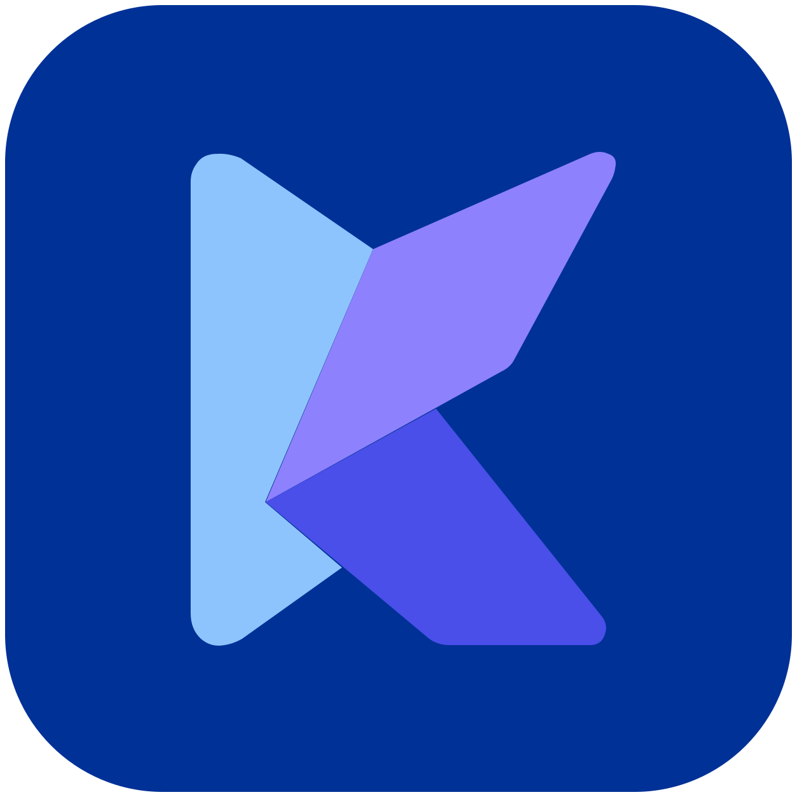

<p align="center">
  
</p>

<h1 align="center">Kite</h1>

<p align="center">
  A quick, lightweight Matrix client built with Flutter and Material Design.
</p>

---

## About

Kite is an open-source Matrix client focused on getting you into your chats quickly with a clean, responsive interface. It uses Flutter for a consistent cross-platform experience and follows Material Design for familiar navigation, typography, controls, theming, and interaction patterns.

The project aims to keep the client simple and fast while supporting the Matrix features people expect from a modern everyday messaging app.

## Design goals

- Fast startup, navigation, and room switching.
- A clean Material Design interface that feels at home on Android and desktop.
- Responsive layouts that scale from phones to larger screens.
- Cached-first rendering so existing conversations remain useful while the network catches up.
- Matrix interoperability through established SDKs and protocol standards.
- Audited Matrix SDK cryptography rather than custom cryptographic implementations.
- Light, dark, and black themes with accessible typography and controls.

## Matrix

Kite is being built around the standard Matrix client flow: authentication, sync, room lists, timelines, messaging, media, notifications, encryption, calls, moderation, and the wider Matrix feature set.

The implementation roadmap and current feature progress are tracked in [ROADMAP.md](ROADMAP.md).

## Development

Requirements:

- Flutter stable
- Android SDK for Android builds
- Platform tooling for any additional desktop or mobile targets you want to build

Useful commands:

```sh
flutter analyze
flutter test
flutter build apk
```

Performance and release validation tooling lives under [`tool/`](tool/) and is documented in [PERFORMANCE.md](PERFORMANCE.md).

## Status

Kite is under active development. The current focus is turning the production Matrix runtime into a complete daily-use client while keeping the UI lightweight and Material-first.

The Kite mark and app icon in this repository are original Kite branding.
