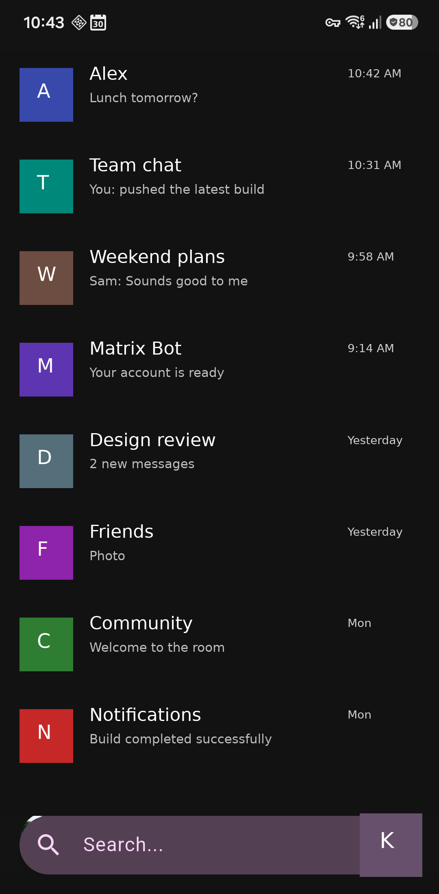
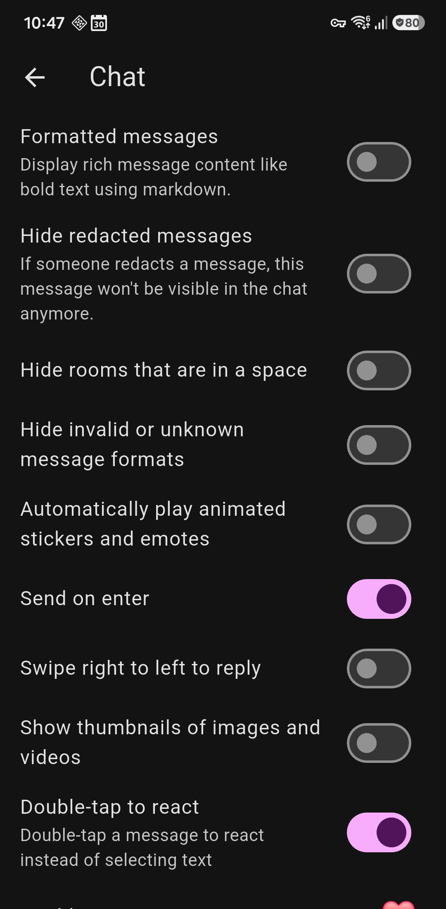

<!--
SPDX-FileCopyrightText: 2019-Present Christian Kußowski
SPDX-FileCopyrightText: 2019-Present Contributors to FluffyChat

SPDX-License-Identifier: AGPL-3.0-or-later
-->

# Kite

Kite is an open-source Matrix client focused on fast, uncluttered messaging and a smooth mobile experience.

This repository is the active Kite app. It is based on FluffyChat and keeps the upstream AGPL-3.0-or-later licensing and attribution while maintaining its own product identity, interface changes, release flow, support pages, and roadmap.

## What Kite changes

- A simplified chat list with a floating bottom search experience.
- Kite-specific settings, branding, icons, links, and Android package identity.
- A reduced message composer and less UI chrome.
- Firebase push support for Kite builds.
- Ongoing performance work aimed at eliminating scroll and timeline jitter.
- Independent releases and issue tracking under brandonp2412/Kite.

## Screenshots

  
  

The chat-list screenshot uses demo names, messages, and avatars; no personal conversation data is included.

## Links

- Source and issues: https://github.com/brandonp2412/Kite
- Privacy: https://brandonp2412.github.io/Kite/privacy/
- Terms: https://brandonp2412.github.io/Kite/terms/
- Support: https://brandonp2412.github.io/Kite/support/
- Matrix protocol: https://matrix.org/

## Build

Kite uses the Flutter version pinned in .tool_versions.yaml.

1. Install Flutter and Rust.
2. Run flutter pub get.
3. For Android builds with Firebase, run ./scripts/add-firebase-messaging.sh after providing the project Firebase configuration.
4. Build with the normal Flutter target command, for example flutter build apk.

Platform-specific helper scripts remain in scripts/.

## Contributing

See CONTRIBUTING.md. Bugs and feature requests belong in this repository's GitHub issues.

## Upstream and licence

Kite is derived from FluffyChat: https://github.com/krille-chan/fluffychat

The project is distributed under AGPL-3.0-or-later. Existing upstream copyright and SPDX notices are intentionally retained where required. See LICENSE for the full licence.
